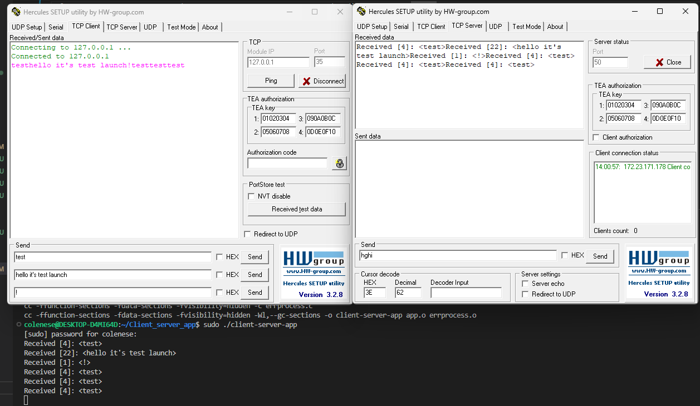

# Client_server_app
- В ходе выполнения задания, я столкнулся с проблемой подключения к Hercules TCP Server, которую пока что не смог решить. Полагаю, что это связано с настройкой сети, продолжаю изучать этот вопрос. В качестве временной альтернативы решил написать программу, имитирующую работу сервера. 

----
- Для запуска проекта необходимо запустить на разных терминалах:
- для запуска "сервера"
```
sudo make server
```
- для запуска приложения
```
sudo make
```
Демонстрация работы:
